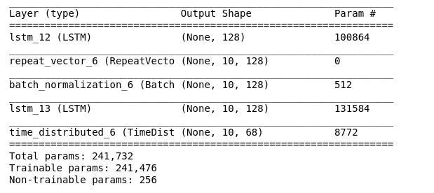
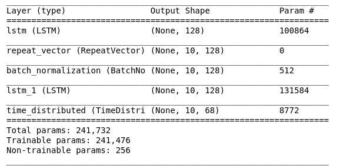
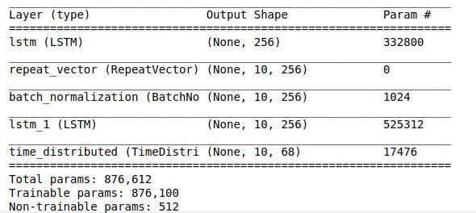
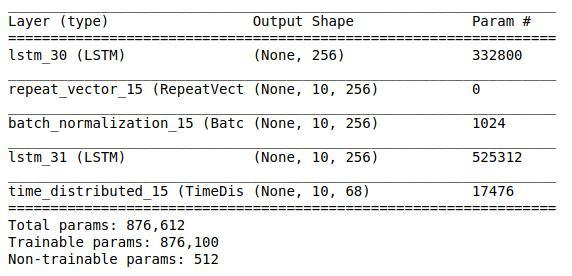

# Sales/rent price parcing

## Were implemented 2 solutions:  
### 1) Without machine learning  
### 2) Applying LSTM models   

## Without ML: 
### The approach is:
#### to split input string by space symbol
##### e.g:   $60,000 - $388,500 : $60,000  - $388,500
#### To get numbers, in every part concatenate all founded digits and dots
##### 60000 388500 
#### If don't found any digits - price is unknown, so make it 0
#### If were founded one number - it is min price, and if there are no "+" or "From", the max price is the same as min. But if there are - max price is unknown and make it 0
#### If were founded 2 numbers, and there are no "+" or "From" - first is min, second is max, if there are - first is min, second is 0

### This solution is universal and works both for sales and rent prices

  

## Using seq2seq LSTM model

### Data augmentation:
### Due to simplicity of data, it was appropriate to generate more datapoints. The way were done is just randomizing all digits.

### Training/validation data:

### Data was splited on 90% training(plus augmentation x1000 times), and 10% validation.

### There are 4 models, that predict sales_min, sales_max, rent_min, rent_max. There could be only 2 models, that have 2 outputs each, it can be implememented in future.

### Models layers:
#### sales_min:

#### sales_max:

#### rent_min:

#### rent_max:

### Validation accuracy for all models is 100%.

### The most significant things, that affected on accuracy were correctly made augmentation and adding batch normalization layer 

